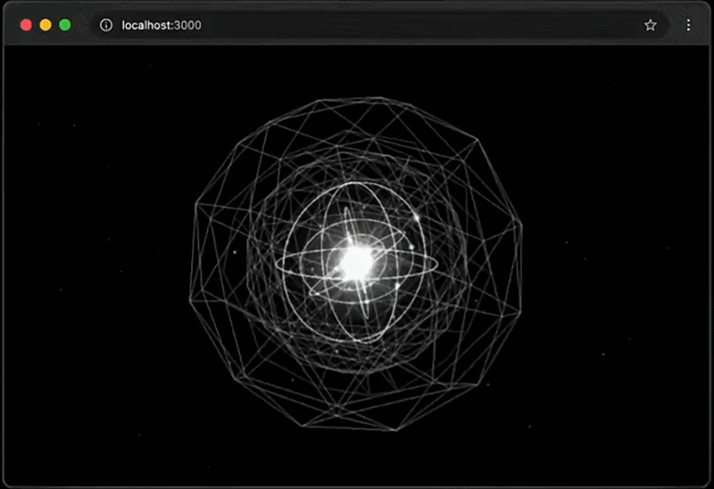

# Hand Tracking Core

A real-time, gesture-controlled 3D visualization built with **Three.js** and **MediaPipe Hand Landmarker**. Control a glowing wireframe orb — complete with orbiting particles, a network shell, and bloom-lit core — using nothing but your webcam and your hands.

## 🎥 Preview



## ✨ Features

- **Hand-tracked interaction** — no mouse or keyboard required
  - 🤏 **Pinch (one hand)** → rotate the orb
  - 🤏🤏 **Pinch (two hands)** → zoom in/out
  - ✊ **Fist** → dive into the core and reveal an inner structure
- **Layered 3D scene** — orbiting rings with electrons, icosahedron wireframes, a procedural point-network "shell," dust fields, and light-flare sprites
- **Post-processing pipeline** — Unreal bloom + chromatic aberration (desktop) for a cinematic glow
- **Adaptive performance** — automatically scales geometry detail, particle counts, and pixel ratio for mobile vs. desktop

## 🛠️ Tech Stack

- [Three.js](https://threejs.org/) — WebGL scene, rendering, and post-processing
- [MediaPipe Hand Landmarker](https://developers.google.com/mediapipe) — real-time hand landmark detection (GPU-accelerated, runs fully in-browser)
- Vanilla JS / ES modules — no build step required

## 🚀 Getting Started

```bash
git clone https://github.com/esvius/hand-tracking-orb.git
cd hand-tracking-orb
```

Serve the folder with any static server (camera access requires a secure context):

```bash
npx serve .
# or
python -m http.server 3000
```

Open `http://localhost:3000`, grant camera permission, and start moving your hands. 🖐️

## 📋 Requirements

- A browser with WebGL2 + WebRTC support (Chrome/Edge recommended)
- A webcam
- Reasonably modern GPU for smooth 60fps bloom rendering

## 📄 License

MIT
